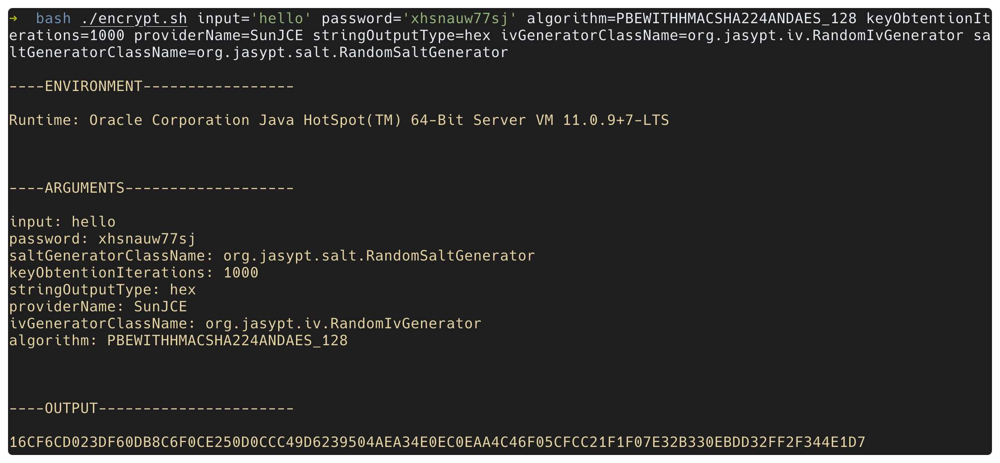
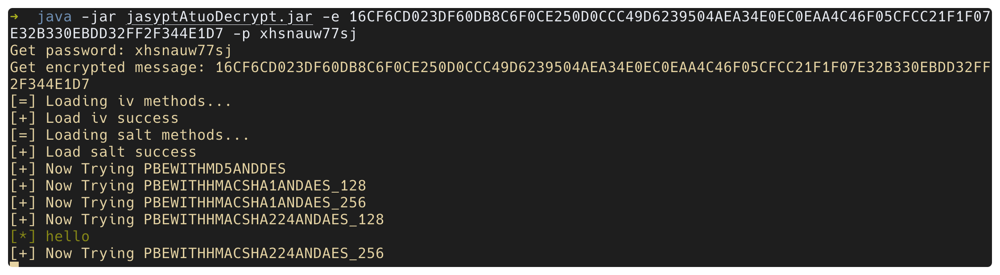
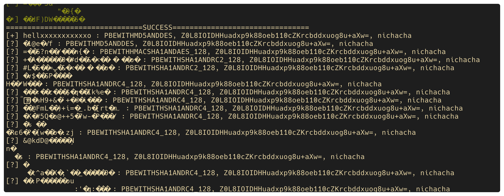

# jasyptAutoDecrypt

在线的那几个咱也不知道咋写的，反正不好使，那就自己造个呗。。。

> 妈妈再也不用怕我试不出来spring的加密密码了

没啥技术含量，就是挨个试一遍。。。

嗯，单线程的，有空再改个多线程吧。。。🤡

## 关于部分fuzz的数值

### keyObtentionIterations

默认是1000，应该能应付绝大部分情况。。。

其余的是我从github上用了jasypt的项目里找的

### StringOutputType

官方文档里都说了，就俩 base64 hex

### algorithm

都是jasypt支持的方式

### salt、iv、其他

jasypt的包里的方法，直接拿来用了（其实可以筛去几个的。。。

需要注意的是jasypt版本问题，新旧版本iv的classname不一样，我这直接用了1.9.3新版的

新版的iv是`org.jasypt.iv` 旧版的是`org.jasypt.salt`

[Springboot使用jasypt需要注意的一个小地方 - 知乎 (zhihu.com)](https://zhuanlan.zhihu.com/p/347135701)

## 傻瓜式用法

```
java -jar jasyptAtuoDecrypt.jar
usage:
 -e,--encryptedMessage <arg>   encryptedMessage
 -h,--help                     display help text
 -p,--password <arg>           password of the encryptedMessage
```



运行过程中成功的会带颜色输出

```
java -jar jasyptAtuoDecrypt.jar -e 16CF6CD023DF60DB8C6F0CE250D0CCC49D6239504AEA34E0EC0EAA4C46F05CFCC21F1F07E32B330EBDD32FF2F344E1D7 -p xhsnauw77sj
Get password: xhsnauw77sj
Get encrypted message: 16CF6CD023DF60DB8C6F0CE250D0CCC49D6239504AEA34E0EC0EAA4C46F05CFCC21F1F07E32B330EBDD32FF2F344E1D7
[=] Loading iv methods...
[+] Load iv success
[=] Loading salt methods...
[+] Load salt success
[+] Now Trying PBEWITHMD5ANDDES
[+] Now Trying PBEWITHHMACSHA1ANDAES_128
[+] Now Trying PBEWITHHMACSHA1ANDAES_256
[+] Now Trying PBEWITHHMACSHA224ANDAES_128
[*] hello
```



运行结束，会统一输出，没有乱吗的会用[+]标出来，乱码的用[?]标出了。


